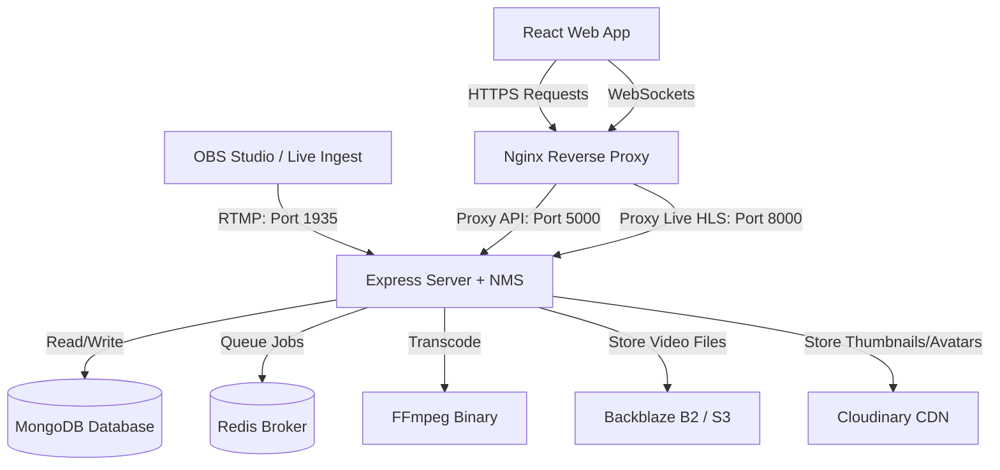

# Kalyra Deployment Guide

This guide details the steps required to deploy **Kalyra** (YouTube-quality video streaming platform) into production. It covers architecture, environment configuration, containerized deployment (Docker Compose), manual VPS deployment (PM2 + Nginx), and cloud deployment.

---

## 1. Architectural Overview

Kalyra consists of three primary components:
1. **React Frontend**: Built with React, Vite, and TailwindCSS. Served as static files via Nginx.
2. **Express API Server (Node.js)**: Handles user authentication, database operations, video metadata, social interactions, and WebSocket events.
3. **Node Media Server (NMS)**: Embedded within the backend server. It ingests live RTMP streams (e.g., from OBS Studio) and packages them into HLS/FLV for client playback.
4. **Redis & Bull Queue**: Manages background asynchronous jobs (such as video transcoding, upload chunk merging, and batch email notifications).
5. **MongoDB**: Stores relational documents (users, videos, comments, audit logs, notifications).



---

## 2. Infrastructure Prerequisites

| Component | Minimum Specification | Recommended Specification | Notes |
| :--- | :--- | :--- | :--- |
| **CPU** | 2 Cores | 4 Cores+ | FFmpeg transcoding is CPU-intensive. |
| **RAM** | 2 GB | 4 GB+ | PM2 cluster mode & Redis require adequate RAM. |
| **Disk Space** | 20 GB | 100 GB+ (SSD) | Local temp transcoding directories require fast storage. |
| **OS** | Linux (Ubuntu 22.04 LTS) | Linux (Ubuntu 22.04 LTS) | Recommended for production stability. |
| **FFmpeg** | v5.0+ | v6.0+ | Must be installed globally with H.264 codecs. |

---

## 3. Environment Variables Configuration

Copy `.env.example` to `.env` (or `server/.env`) and configure the variables:

```ini
# ===========================================
# Kalyra Production Environment Variables
# ===========================================

# Server Configuration
NODE_ENV=production
PORT=5000
CLIENT_URL=https://yourdomain.com

# MongoDB (Production MongoDB Atlas cluster recommended)
MONGODB_URI=mongodb+srv://<username>:<password>@cluster.mongodb.net/kalyra?retryWrites=true&w=majority

# Redis (Production Redis Cloud or managed instance recommended)
REDIS_HOST=your-redis-host.db.redis.io
REDIS_PORT=6379
REDIS_PASSWORD=your_redis_password
REDIS_TLS=true

# JWT Secrets (Ensure these are long cryptographically secure random strings)
JWT_ACCESS_SECRET=your_super_secure_access_secret_64_characters_min
JWT_REFRESH_SECRET=your_super_secure_refresh_secret_64_characters_min
JWT_ACCESS_EXPIRY=15m
JWT_REFRESH_EXPIRY=7d

# Google OAuth Credentials (Get from Google Cloud Console)
GOOGLE_CLIENT_ID=your_google_client_id.apps.googleusercontent.com
GOOGLE_CLIENT_SECRET=your_google_client_secret
GOOGLE_CALLBACK_URL=https://yourdomain.com/api/auth/google/callback

# Backblaze B2 (S3-Compatible Object Storage for video transcoding/hosting)
B2_ENDPOINT=https://s3.us-east-005.backblazeb2.com
B2_REGION=us-east-005
B2_KEY_ID=your_b2_key_id
B2_APPLICATION_KEY=your_b2_application_key
B2_BUCKET_NAME=your_b2_bucket_name
B2_BUCKET_ID=your_b2_bucket_id

# Cloudinary (Used for image assets, profile pictures, and thumbnails)
CLOUDINARY_CLOUD_NAME=your_cloudinary_cloud_name
CLOUDINARY_API_KEY=your_cloudinary_api_key
CLOUDINARY_API_SECRET=your_cloudinary_api_secret

# Email Service (SMTP Server for automated notifications and passwords resets)
SMTP_HOST=smtp.gmail.com
SMTP_PORT=587
SMTP_USER=your_email@gmail.com
SMTP_PASS=your_gmail_app_password
EMAIL_FROM=Kalyra <noreply@yourdomain.com>

# Node Media Server (Ports for stream ingestion and live delivery)
NMS_RTMP_PORT=1935
NMS_HTTP_PORT=8000

# FFmpeg Installation Path
FFMPEG_PATH=/usr/bin/ffmpeg

# Primary Administrator Email (Grants admin panel privileges automatically)
ADMIN_EMAIL=admin@yourdomain.com
```

---

## 4. Deployment Option A: Multi-Container Docker Compose (Recommended)

Docker Compose wraps all components (MongoDB, Redis, Node API server with FFmpeg pre-installed, and React served by Nginx) into a single, cohesive unit.

### Step 1: Clone and Configure Env
Ensure you have created `server/.env` containing all production values.

### Step 2: Build & Spin Up Services
Run the built-in NPM script in the root directory:
```bash
npm run docker:up
```
This runs `docker-compose up --build` behind the scenes, creating the following:
* **`kalyra-mongodb`**: Native MongoDB database container persisting data to local Docker volume `mongo-data`.
* **`kalyra-redis`**: Alpine-based Redis database container persisting key-value store cache to `redis-data`.
* **`kalyra-server`**: Build from `server/Dockerfile` containing Node.js 20, global FFmpeg binaries, and Node Media Server.
* **`kalyra-client`**: Multi-stage build that transpiles the React frontend and deploys it in a production-ready Nginx container mapping traffic on port `80`.

### Step 3: Tear Down
To stop and clean up containers:
```bash
npm run docker:down
```

> [!WARNING]
> In-app System Configuration: If an administrator updates database credentials/keys directly from the Admin Panel, changes are written to the server's `.env` file. To persist these edits across Docker rebuilds, map the `.env` file as a volume in `docker-compose.yml`:
> ```yaml
> volumes:
>   - ./server/.env:/usr/src/app/.env
> ```

---

## 5. Deployment Option B: Manual VPS Setup (Nginx + PM2)

If you prefer to run services bare-metal or on a standard Linux Virtual Machine (Ubuntu 22.04 LTS), follow this PM2 and Nginx configuration guide.

### Step 1: Install Dependencies
```bash
# Update repositories
sudo apt update && sudo apt upgrade -y

# Install Node.js v20 LTS
curl -fsSL https://deb.nodesource.com/setup_20.x | sudo -E bash -
sudo apt-get install -y nodejs

# Install FFmpeg, Git, Nginx, MongoDB, and Redis
sudo apt install -y ffmpeg git nginx mongodb redis-server

# Verify services are running
sudo systemctl status mongodb
sudo systemctl status redis-server
```

### Step 2: Set up the Repository
```bash
# Clone the repository
git clone <your-repo-url> /var/www/kalyra
cd /var/www/kalyra

# Install dependencies for root, client, and server
npm run install:all
```

### Step 3: Configure PM2 for Backend Application
PM2 runs the server in the background and restarts it on system reboot.
```bash
# Install PM2 globally
sudo npm install -g pm2

# Configure environment variables in /var/www/kalyra/server/.env
# Make sure to point FFMPEG_PATH to: /usr/bin/ffmpeg

# Start server using the PM2 configuration file in cluster mode
cd /var/www/kalyra/server
pm2 start ecosystem.config.cjs --env production

# Ensure PM2 starts on system reboot
pm2 startup
pm2 save
```

### Step 4: Build and Deploy Frontend Client
```bash
cd /var/www/kalyra/client
npm run build
```
This builds static assets into the `/var/www/kalyra/client/dist` directory.

### Step 5: Configure Nginx Reverse Proxy
Create a new Nginx block:
```bash
sudo nano /etc/nginx/sites-available/kalyra
```

Paste the following configuration:
```nginx
server {
    listen 80;
    server_name yourdomain.com www.yourdomain.com;

    # Gzip Compression
    gzip on;
    gzip_types text/plain text/css application/json application/javascript text/xml application/xml;

    # React Frontend
    location / {
        root /var/www/kalyra/client/dist;
        index index.html;
        try_files $uri $uri/ /index.html;
    }

    # API Proxy
    location /api {
        proxy_pass http://localhost:5000;
        proxy_http_version 1.1;
        proxy_set_header Upgrade $http_upgrade;
        proxy_set_header Connection 'upgrade';
        proxy_set_header Host $host;
        proxy_cache_bypass $http_upgrade;
        proxy_set_header X-Real-IP $remote_addr;
        proxy_set_header X-Forwarded-For $proxy_add_x_forwarded_for;
        proxy_set_header X-Forwarded-Proto $scheme;
    }

    # Static uploads proxy (if hosting locally)
    location /uploads {
        proxy_pass http://localhost:5000;
        proxy_set_header Host $host;
    }

    # Socket.io connection proxy
    location /socket.io {
        proxy_pass http://localhost:5000;
        proxy_http_version 1.1;
        proxy_set_header Upgrade $http_upgrade;
        proxy_set_header Connection "Upgrade";
        proxy_set_header Host $host;
        proxy_set_header X-Real-IP $remote_addr;
        proxy_set_header X-Forwarded-For $proxy_add_x_forwarded_for;
    }

    # Live streams proxy (HLS index and TS segment files from NMS)
    location ~* ^/live/.*\.(m3u8|ts|flv)$ {
        proxy_pass http://localhost:8000;
        proxy_buffering off;
        proxy_set_header Host $host;
        proxy_set_header X-Real-IP $remote_addr;
        proxy_set_header X-Forwarded-For $proxy_add_x_forwarded_for;
        
        # CORS permissions for cross-origin HLS requests
        add_header Access-Control-Allow-Origin *;
    }
}
```

Enable the configuration and reload Nginx:
```bash
sudo ln -s /etc/nginx/sites-available/kalyra /etc/nginx/sites-enabled/
sudo nginx -t
sudo systemctl reload nginx
```

### Step 6: Secure with Let's Encrypt SSL
```bash
sudo apt install certbot python3-certbot-nginx
sudo certbot --nginx -d yourdomain.com -d www.yourdomain.com
```

---

## 6. Deployment Option C: Hybrid Cloud Setup (Vercel + Render)

This section details how to deploy the React frontend on **Vercel** and the Express backend on **Render**.

> [!WARNING]
> **Core Architectural Limitation**: Render Web Services do not support public raw TCP port binding. Therefore, **Live RTMP streaming (e.g. broadcasting from OBS on port 1935) will not work**. All other features (regular video uploads, transcoding via Redis/Bull, watch parties, community posts, notifications, and chat) will work perfectly.

### Step 1: Deploy Backend on Render (Web Service)

Render supports deploying Node.js apps via standard Node environments or custom Dockerfiles. Since Kalyra requires FFmpeg for video processing/transcoding, we must use Render's **Docker** environment:

1. Create a Render account and connect your GitHub repository.
2. Click **New +** > **Web Service**.
3. Select the Kalyra repository.
4. Configure the Web Service:
   - **Name**: `kalyra-api`
   - **Root Directory**: `server` (Must be the server subfolder)
   - **Runtime**: `Docker` (Render will automatically detect `server/Dockerfile`)
   - **Instance Type**: Paid tier (e.g., Starter or higher) is highly recommended. The free tier will sleep after 15 minutes of inactivity, which disconnects all active socket connections.
5. In the **Environment Variables** section, add all variables defined in `server/.env.example` (MongoDB URI, Redis Cloud credentials, JWT secrets, Cloudinary credentials, Backblaze B2 keys, and SMTP credentials). Make sure `NODE_ENV` is set to `production`.
6. Click **Deploy Web Service**. Render will build the Docker container and expose a public URL (e.g. `https://kalyra-api.onrender.com`).

### Step 2: Configure Client Routing (vercel.json)

To prevent cross-origin issues and support secure cookie authentication, we use Vercel's **Rewrites** to proxy backend HTTP API traffic:

1. Open `client/vercel.json`.
2. Update the `destination` fields to match your deployed Render API URL:
   ```json
   {
     "rewrites": [
       {
         "source": "/api/:path*",
         "destination": "https://your-render-app.onrender.com/api/:path*"
       },
       {
         "source": "/uploads/:path*",
         "destination": "https://your-render-app.onrender.com/uploads/:path*"
       }
     ]
   }
   ```
3. Commit and push this change to your repository.

### Step 3: Deploy Frontend on Vercel

1. Log into your Vercel account and click **Add New** > **Project**.
2. Select your GitHub repository.
3. Configure the Project:
   - **Framework Preset**: `Vite` (Vercel will auto-detect Vite)
   - **Root Directory**: `client`
4. Expand **Build and Development Settings**:
   - **Build Command**: `npm run build`
   - **Output Directory**: `dist`
5. Expand **Environment Variables** and add:
   - `VITE_WS_URL`: `https://your-render-app.onrender.com` (This tells Socket.io to connect directly to the Render WebSocket server rather than rewriting through Vercel's serverless pipeline).
6. Click **Deploy**. Vercel will build and serve your static React client at a URL like `https://kalyra.vercel.app`.

---

## 7. Live Streaming Ingest Configuration

Once deployed, creators can broadcast live using tools like OBS Studio:
1. **Stream Server URL**: `rtmp://yourdomain.com:1935/live` (Note: Ensure firewall port `1935` is open).
2. **Stream Key**: Generated upon starting a live broadcast in the user's Studio dashboard (e.g., `str_8dfa...`).
3. **Playback**: The client automatically starts playing the live feed from `https://yourdomain.com/live/<stream-key>/index.m3u8` using HLS.

---

## 8. Backup and Maintenance

### Database Backups (Cron Job)
Create a daily MongoDB backup cron script:
```bash
#!/bin/bash
BACKUP_DIR="/backups/mongodb"
DATE=$(date +%Y-%m-%d_%H-%M-%S)
mongodump --uri="mongodb://localhost:27017/streamvibe" --out="$BACKUP_DIR/$DATE"
tar -czf "$BACKUP_DIR/kalyra_db_$DATE.tar.gz" "$BACKUP_DIR/$DATE"
rm -rf "$BACKUP_DIR/$DATE"
```

### Clearing DB for staging/test
If you need to completely purge the database (all users, analytics, and videos) to start fresh, execute the clean database script from the server directory:
```bash
cd server
npm run clean
```

---

## 9. Troubleshooting Production Issues

> [!IMPORTANT]
> **WS Connection Failing (Socket.IO)**: Ensure your proxy header settings in Nginx are set to `Connection "Upgrade"` and `Upgrade $http_upgrade`. Without these, websockets will fall back to long polling.

> [!TIP]
> **Video Transcoding hangs or fails**: 
> 1. Check your Server CPU utilization (`htop`). Video encoding requires high compute.
> 2. Ensure `FFMPEG_PATH` is correctly configured to the full directory path in `.env`.
> 3. Verify Redis connection is active (`pm2 logs`). Jobs are scheduled in Redis queue; if Redis drops, transcoding halts.

> [!WARNING]
> **CORS Block on HLS streams**: If Nginx returns 403 or CORS errors for `.ts` media segments, verify that `add_header Access-Control-Allow-Origin *;` is active inside the `/live` location block in Nginx.
